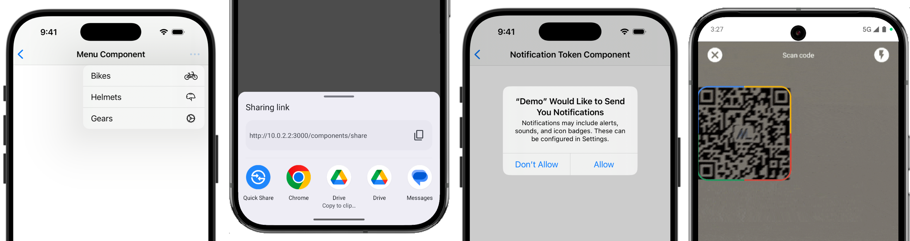

# Bridge Components for Hotwire Native apps

> by [Joe Masilotti](https://masilotti.com), the Hotwire Native guy

[Hotwire Native](https://native.hotwired.dev) enables seamless communication between native Swift and Kotlin code and web views in hybrid mobile apps. [Bridge components](https://native.hotwired.dev/overview/bridge-components) extend this functionality by providing reusable native components that interact your web views. They enable developers to break out of the web view container and **drive native features**.

This repository contains generalized, production-ready bridge components extracted from [real-world client projects](https://masilotti.com/services/). Once installed, each component can be added to any page of your app and customized with a bit of HTML.



## Components

[See all the components](https://masilotti.com/bridge-components/#components)

* [Alert](components/alert/)
* [Barcode Scanner](components/barcode-scanner/)
* [Biometrics Lock](components/biometrics-lock/)
* [Button](components/button/)
* [Document Scanner](components/document-scanner/)
* [Form](components/form/)
* [Haptic](components/haptic/)
* [Location](components/location/)
* [Menu](components/menu/)
* [Notification Token](components/notification-token/)
* [Permissions](components/permissions/)
* [Review Prompt](components/review-prompt/)
* [Search](components/search/)
* [Share](components/share/)
* [Theme](components/theme/)
* [Toast](components/toast/)

## Requirements

* Web: [Hotwire Native Bridge](https://native.hotwired.dev/reference/bridge-installation)
* iOS: [Hotwire Native iOS](https://github.com/hotwired/hotwire-native-ios) v1.2 or later
* Android:
    * [Hotwire Native Android](https://github.com/hotwired/hotwire-native-android) v1.0 or later
    * [Jetpack Compose](https://developer.android.com/develop/ui/compose/setup)
    * A serialization library, like [kotlinx.serialization](https://github.com/Kotlin/kotlinx.serialization?tab=readme-ov-file#setup)
    * [Material Symbol](https://fonts.google.com/icons) font if using images
        * Unzip the downloaded font and copy the Outlined version `.ttf` to `app/src/main/res/font/material_symbols.ttf`

Check the [`examples/` directoy](examples/) for demo iOS, Android, and Rails apps.

## Installation

Each component requires a Stimulus controller and a Swift/Kotlin component.

### Web - Stimulus controllers

#### 1. Install the bridge-components package

Add the `bridge-components` module via yarn:

```bash
yarn add @joemasilotti/bridge-components
```

or npm:

```bash
npm install @joemasilotti/bridge-components
```

or with Rails importmaps:

```bash
bin/importmap pin @joemasilotti/bridge-components
```

#### 2. Register the Stimulus controllers

Register the Stimulus controllers after starting your Stimulus application.

Register all the available controllers:

```javascript
import { Application } from "@hotwired/stimulus"
import { controllers } from "@joemasilotti/bridge-components"

const application = Application.start()
application.load(controllers)
```

or manually register individual controllers:

```javascript
import { Application } from "@hotwired/stimulus"
import { AlertBridgeController, ButtonBridgeController } from "@joemasilotti/bridge-components"

const application = Application.start()
application.register("bridge--alert", AlertBridgeController)
application.register("bridge--button", ButtonBridgeController)
```

### iOS - Swift components

#### 1. Add the Swift package dependency

In Xcode, select File → Add Packages Dependencies… and enter `https://github.com/joemasilotti/bridge-components` in the search field. Make sure your project is set under "Add to Project" and click Add Package.


Then click Add Package again.

#### 2. Register the native components

Register all the available components:

```swift
import BridgeComponents
import HotwireNative
import UIKit

@main
class AppDelegate: UIResponder, UIApplicationDelegate {
    func application(_ application: UIApplication, didFinishLaunchingWithOptions launchOptions: [UIApplication.LaunchOptionsKey: Any]?) -> Bool {
        Hotwire.registerBridgeComponents(BridgeComponent.all)
        return true
    }
}
```

or manually register individual components:

```swift
import BridgeComponents
import HotwireNative
import UIKit

@main
class AppDelegate: UIResponder, UIApplicationDelegate {
    func application(_ application: UIApplication, didFinishLaunchingWithOptions launchOptions: [UIApplication.LaunchOptionsKey: Any]?) -> Bool {
        Hotwire.registerBridgeComponents([
            AlertComponent.self,
            ButtonComponent.self,
        ])
        return true
    }
}
```

### Android - Kotlin components

> [!WARNING]
> Android usage still requires manual installation. An official Gradle package is coming soon!

1. Copy the Kotlin file (`ExampleComponent.kt`) into your Android Studio project.
1. Register the component inside your `Application` subclass.

```kotlin
package com.masilotti.demo // Change to your package name.

import android.app.Application
import com.masilotti.demo.components.ExampleComponent // Import component here.
import dev.hotwire.core.bridge.BridgeComponentFactory
import dev.hotwire.core.bridge.KotlinXJsonConverter
import dev.hotwire.core.config.Hotwire
import dev.hotwire.navigation.config.registerBridgeComponents

class DemoApplication : Application() {
    override fun onCreate() {
        super.onCreate()

        Hotwire.registerBridgeComponents(
            BridgeComponentFactory("example", ::ExampleComponent)
        )
    }
}
```

## Usage

Once installed, use a component by adding a `data-controller` attribute that matches the name of the Stimulus controller.

For example, to use the [Button Component](components/button/):

```html
<a href="#" data-controller="bridge--button">Button</a>
```

Each component can then be configured further. Check the component's README in the [`components/` directory](components/) for more information.

## Need help?

If you need help installing, configuring, or using the components, feel free to [open a new discussion](https://github.com/joemasilotti/bridge-components/discussions/new?category=q-a) or [send me an email](mailto:joe@masilotti.com). I'd love to help!
