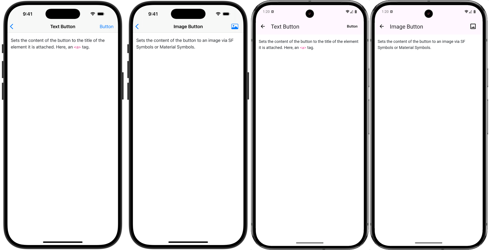

# Button Component

Adds a native button to the navigation bar on iOS and action bar on Android.

When the native button is tapped, the underlying HTML button will be clicked.

The button can contain either a text string or an image.



## Text button

Sets the content of the button to the title of the element it is attached. Here, an `<a>` tag.

```erb
<%= link_to "Button", "#", data: {
  controller: "bridge--button"
} %>
```

## Image button

Sets the content of the button to an image.

iOS uses [SF Symbols](https://developer.apple.com/sf-symbols/), set `bridge-ios-image` to the name of the symbol.

Android uses [Material Symbols](https://fonts.google.com/icons), set `bridge-android-image` to the icon name.

```erb
<%= link_to "Button", "#", data: {
  controller: "bridge--button",
  bridge_ios_image: "photo",
  bridge_android_image: "Image"
} %>
```

For Android, download the [Material Symbols](https://fonts.google.com/icons) font and unzip the Outlined version to `app/src/main/res/font/material_symbols.ttf`.

## Hide the HTML button

Hide the HTML button when the "button" component is registered with the following CSS.

```css
[data-bridge-components~="button"]
[data-controller~="bridge--button"] {
  display: none;
}
```
